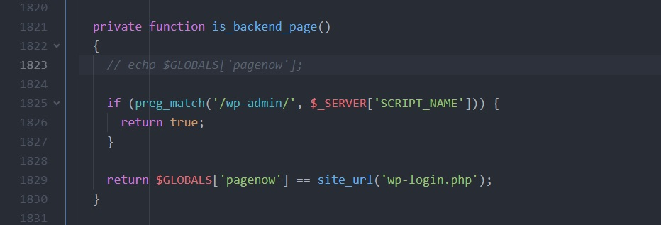

\# WordPress Plugin : ip2location-country-blocker-v-2.19.1-quick-fix

\*\*WordPress Plugin ip2location-country-blocker v 2.19.1 quick fix by
Amirhosseinhpv\*\*

 

Hello everyone, i just updated to 2.19.1 and noticed it prints out index.php in
every single post and i cannot see any archive pages. so i checked the source
and found the problem. in the main plugin file (ip2location-country-blocker.php)
go to line 1823 and comment this line :

 

\`echo \$GLOBALS['pagenow'];\`

 

by adding \<strong\>//\</strong\> at the beginning of line \~\>

 

\`//echo \$GLOBALS['pagenow'];\`

 

see the image 👇🏻

 

\

 

It'll fix the issue.

 

 

Amirhosseinhpv,

 

Thanks for reading.
